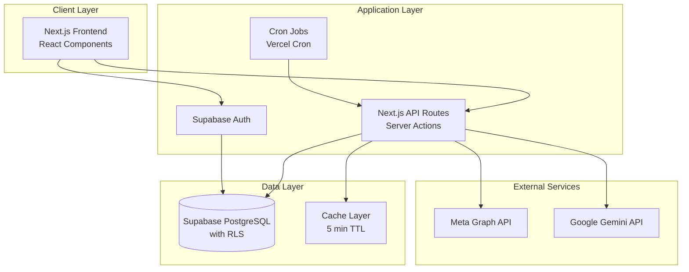
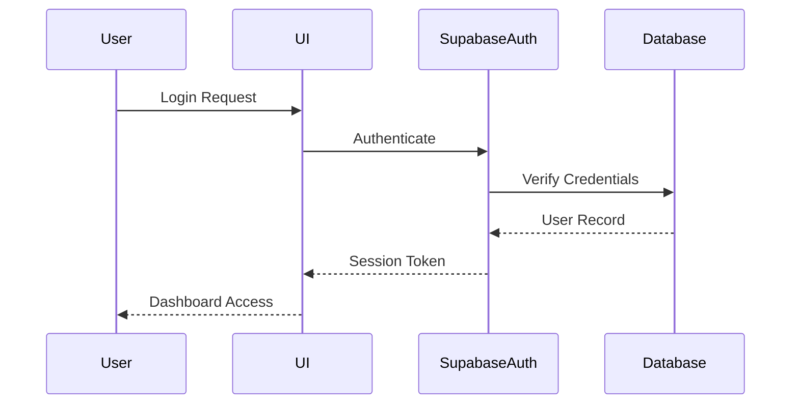
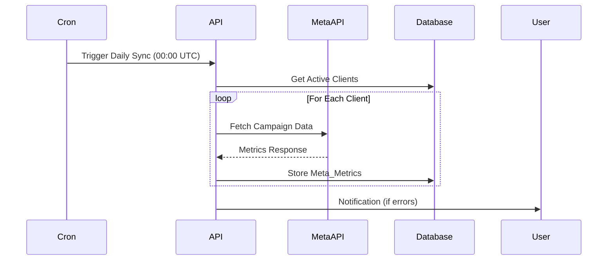
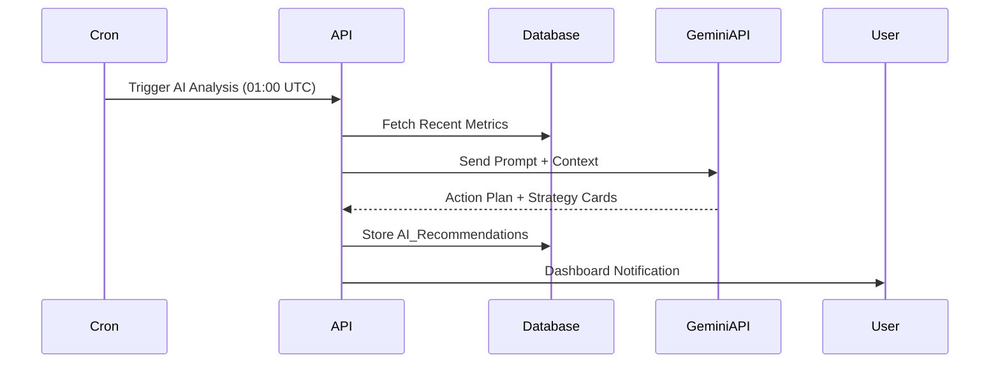
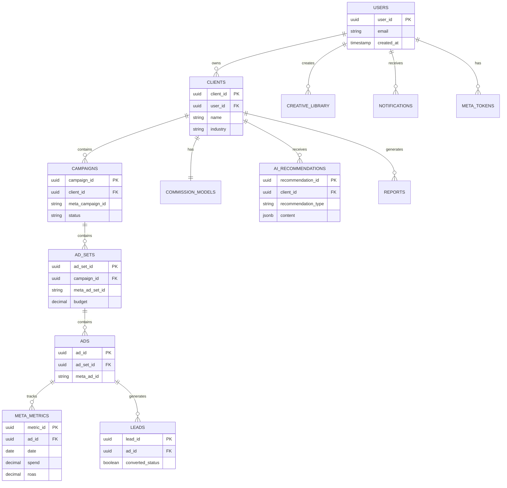

# Technical Design Document: GrowthPilot AI

## Overview

GrowthPilot AI, dijital pazarlama danışmanlarının müşteri portföylerini, Meta Ads kampanyalarını ve komisyon gelirlerini yönetmelerini sağlayan yapay zeka destekli bir B2B SaaS platformudur. Sistem, Meta Ads API'den otomatik veri çekerek Google Gemini AI ile analiz yapar ve kullanıcılara proaktif stratejiler, optimizasyon önerileri ve otomatik raporlama sunar.

### Core Technology Stack

- **Frontend**: Next.js 14 (App Router), React 18, TypeScript
- **Styling**: TailwindCSS, Shadcn/UI component library
- **Backend**: Next.js API Routes, Server Actions
- **Database**: Supabase (PostgreSQL with RLS)
- **Authentication**: Supabase Auth (Email/Password + Google OAuth)
- **External APIs**: Meta Graph API, Google Gemini API
- **Deployment**: Vercel (recommended for Next.js)

### Key Design Principles

1. **Security First**: Row-level security (RLS) policies ensure data isolation between users
2. **API Resilience**: Exponential backoff retry logic for external API failures
3. **Performance**: Caching strategies, pagination, and async processing for large datasets
4. **AI-Driven Insights**: Gemini AI analyzes metrics and generates actionable recommendations
5. **User Experience**: Turkish language support, responsive design, intuitive navigation

## Architecture

### System Architecture



### Data Flow Patterns

#### 1. Authentication Flow


#### 2. Meta Ads Data Sync Flow


#### 3. AI Recommendation Flow


## Components and Interfaces

### Frontend Components

#### 1. Authentication Components
- `LoginForm`: Email/password authentication with validation
- `GoogleAuthButton`: OAuth integration with Supabase
- `ProtectedRoute`: HOC for route protection

#### 2. Dashboard Components
- `DashboardLayout`: Main layout with sidebar and header
- `OverviewCards`: Financial metrics summary (clients, spend, revenue, campaigns)
- `SpendingChart`: Line chart for 30-day spending trends (using Recharts)
- `RevenueChart`: Line chart for 30-day revenue trends
- `NotificationCenter`: Dropdown with unread notifications

#### 3. Client Management Components
- `ClientList`: Paginated table of clients with search/filter
- `ClientForm`: Create/edit client modal with validation
- `ClientDetailView`: Single client view with campaigns and metrics

#### 4. Campaign Components
- `CampaignList`: Hierarchical view (Campaign > Ad Set > Ad)
- `MetricsTable`: Display spend, ROAS, CTR, CPC, etc.
- `SyncButton`: Manual sync trigger with loading state

#### 5. AI Components
- `ActionPlanCard`: Daily top 3 priority actions with checkboxes
- `StrategyCard`: Do's (green) and Don'ts (red) recommendations
- `DismissButton`: Archive strategy cards

#### 6. Reporting Components
- `ReportGenerator`: Form to select period, metrics, and format
- `ReportPreview`: Preview before download
- `ReportHistory`: List of generated reports

#### 7. Creative Generator Components
- `IndustrySelector`: Dropdown for industry selection
- `ContentTypeSelector`: Radio buttons (ad copy, video script, voiceover)
- `GeneratedContentEditor`: Editable textarea with save to library

#### 8. Lead Management Components
- `LeadList`: Table with conversion toggle buttons
- `LeadQualityMetrics`: Conversion rate per campaign/ad

### Backend API Routes

#### Authentication Routes
- `POST /api/auth/login`: Email/password authentication
- `POST /api/auth/logout`: Session invalidation
- `GET /api/auth/session`: Current session validation

#### Client Routes
- `GET /api/clients`: List all clients for authenticated user
- `POST /api/clients`: Create new client
- `PUT /api/clients/:id`: Update client
- `DELETE /api/clients/:id`: Archive client and campaigns

#### Campaign Routes
- `GET /api/campaigns`: List campaigns with optional client filter
- `GET /api/campaigns/:id/metrics`: Get metrics for specific campaign
- `POST /api/campaigns/sync`: Trigger manual Meta API sync

#### Meta API Integration Routes
- `POST /api/meta/connect`: OAuth flow initiation
- `GET /api/meta/callback`: OAuth callback handler
- `POST /api/meta/sync`: Sync campaign data (called by cron)

#### AI Routes
- `POST /api/ai/action-plan`: Generate daily action plan
- `POST /api/ai/strategy-cards`: Generate strategy cards
- `POST /api/ai/creative`: Generate creative content
- `PUT /api/ai/recommendations/:id`: Update recommendation status

#### Report Routes
- `POST /api/reports/generate`: Generate report (WhatsApp/PDF)
- `GET /api/reports`: List generated reports
- `GET /api/reports/:id/download`: Download report file

#### Lead Routes
- `GET /api/leads`: List leads with conversion status
- `PUT /api/leads/:id/status`: Update lead conversion status

#### Notification Routes
- `GET /api/notifications`: Get user notifications
- `PUT /api/notifications/:id/read`: Mark notification as read

### External API Integrations

#### Meta Graph API Integration

**Authentication**:
- OAuth 2.0 flow with `ads_read` and `ads_management` permissions
- Access tokens stored encrypted in database
- Token refresh logic with 60-day expiration handling

**Data Retrieval**:
```typescript
interface MetaAPIClient {
  // Fetch campaigns for an ad account
  getCampaigns(adAccountId: string): Promise<Campaign[]>;
  
  // Fetch ad sets for a campaign
  getAdSets(campaignId: string): Promise<AdSet[]>;
  
  // Fetch ads for an ad set
  getAds(adSetId: string): Promise<Ad[]>;
  
  // Fetch insights (metrics) for an ad
  getAdInsights(adId: string, dateRange: DateRange): Promise<Metrics>;
}
```

**Metrics Mapping**:
- `spend`: Total amount spent
- `impressions`: Number of times ads were shown
- `clicks`: Number of clicks
- `conversions`: Purchase events
- `actions`: Array containing add_to_cart, purchases, etc.
- Calculated fields: ROAS, CTR, CPC, CPM, CPA, frequency

**Rate Limiting**:
- Meta API: 200 calls per hour per user
- Implement request queue with exponential backoff
- Cache responses for 5 minutes

#### Google Gemini API Integration

**Model**: `gemini-1.5-flash` (cost-effective for production)

**Prompt Templates**:

1. **Action Plan Prompt**:
```
Sen bir dijital pazarlama uzmanısın. Aşağıdaki kampanya verilerini analiz et ve bugün yapılması gereken en önemli 3 aksiyonu belirle.

Müşteri: {client_name}
Sektör: {industry}
Kampanya Performansı:
- Toplam Harcama: {spend} TRY
- ROAS: {roas}
- Dönüşüm Sayısı: {conversions}
- Bütçe Kullanımı: {budget_utilization}%
- Frekans: {frequency}
- Sepete Ekleme: {add_to_cart}
- Satın Alma: {purchases}

Her aksiyon için:
1. Aksiyonun açıklaması
2. Öncelik seviyesi (Yüksek/Orta/Düşük)
3. Beklenen etki

JSON formatında yanıt ver:
[
  {
    "action": "string",
    "priority": "high|medium|low",
    "expected_impact": "string"
  }
]
```

2. **Strategy Card Prompt**:
```
Sen bir dijital pazarlama stratejistisin. Aşağıdaki metrik için "Yapılması Gerekenler" ve "Yapılmaması Gerekenler" listesi oluştur.

Durum: {situation_description}
Metrik: {metric_name} = {metric_value}
Eşik: {threshold}

JSON formatında yanıt ver:
{
  "do_actions": ["string", "string", "string"],
  "dont_actions": ["string", "string", "string"],
  "reasoning": "string"
}
```

3. **Creative Generator Prompt**:
```
Sen bir kreatif içerik üreticisisin. Aşağıdaki bilgilere göre {content_type} oluştur.

Sektör: {industry}
Hedef Kitle: {target_audience}
Kampanya Amacı: {objective}
Ton: {tone}

{content_type} için 3 farklı varyasyon üret. Her varyasyon:
- Dikkat çekici olmalı
- Dönüşüm odaklı olmalı
- Sektöre uygun olmalı

JSON formatında yanıt ver:
{
  "variations": [
    {
      "title": "string",
      "content": "string",
      "cta": "string"
    }
  ]
}
```

**Token Limits**:
- Action Plan: 500 tokens max
- Strategy Cards: 300 tokens max
- Creative Content: 1000 tokens max

**Error Handling**:
- Retry up to 3 times with exponential backoff (1s, 2s, 4s)
- Fallback to cached recommendations if API unavailable
- Log all API errors for monitoring

## Data Models

### Database Schema

#### Users Table
```sql
CREATE TABLE users (
  user_id UUID PRIMARY KEY DEFAULT uuid_generate_v4(),
  email VARCHAR(255) UNIQUE NOT NULL,
  created_at TIMESTAMP WITH TIME ZONE DEFAULT NOW(),
  updated_at TIMESTAMP WITH TIME ZONE DEFAULT NOW()
);

-- RLS Policy
ALTER TABLE users ENABLE ROW LEVEL SECURITY;
CREATE POLICY "Users can only access their own data"
  ON users FOR ALL
  USING (auth.uid() = user_id);
```

#### Clients Table
```sql
CREATE TABLE clients (
  client_id UUID PRIMARY KEY DEFAULT uuid_generate_v4(),
  user_id UUID NOT NULL REFERENCES users(user_id) ON DELETE CASCADE,
  name VARCHAR(255) NOT NULL,
  industry VARCHAR(100),
  contact_email VARCHAR(255),
  contact_phone VARCHAR(50),
  created_at TIMESTAMP WITH TIME ZONE DEFAULT NOW(),
  updated_at TIMESTAMP WITH TIME ZONE DEFAULT NOW()
);

CREATE INDEX idx_clients_user_id ON clients(user_id);

-- RLS Policy
ALTER TABLE clients ENABLE ROW LEVEL SECURITY;
CREATE POLICY "Users can only access their own clients"
  ON clients FOR ALL
  USING (user_id = auth.uid());
```

#### Commission_Models Table
```sql
CREATE TABLE commission_models (
  model_id UUID PRIMARY KEY DEFAULT uuid_generate_v4(),
  client_id UUID NOT NULL REFERENCES clients(client_id) ON DELETE CASCADE,
  commission_percentage DECIMAL(5,2) NOT NULL CHECK (commission_percentage >= 0 AND commission_percentage <= 100),
  calculation_basis VARCHAR(50) NOT NULL CHECK (calculation_basis IN ('sales_revenue', 'total_revenue')),
  created_at TIMESTAMP WITH TIME ZONE DEFAULT NOW()
);

CREATE INDEX idx_commission_models_client_id ON commission_models(client_id);

-- RLS Policy
ALTER TABLE commission_models ENABLE ROW LEVEL SECURITY;
CREATE POLICY "Users can access commission models for their clients"
  ON commission_models FOR ALL
  USING (client_id IN (SELECT client_id FROM clients WHERE user_id = auth.uid()));
```

#### Campaigns Table
```sql
CREATE TABLE campaigns (
  campaign_id UUID PRIMARY KEY DEFAULT uuid_generate_v4(),
  client_id UUID NOT NULL REFERENCES clients(client_id) ON DELETE CASCADE,
  meta_campaign_id VARCHAR(255) UNIQUE NOT NULL,
  campaign_name VARCHAR(255) NOT NULL,
  status VARCHAR(50) NOT NULL,
  created_at TIMESTAMP WITH TIME ZONE DEFAULT NOW(),
  updated_at TIMESTAMP WITH TIME ZONE DEFAULT NOW()
);

CREATE INDEX idx_campaigns_client_id ON campaigns(client_id);
CREATE INDEX idx_campaigns_meta_campaign_id ON campaigns(meta_campaign_id);

-- RLS Policy
ALTER TABLE campaigns ENABLE ROW LEVEL SECURITY;
CREATE POLICY "Users can access campaigns for their clients"
  ON campaigns FOR ALL
  USING (client_id IN (SELECT client_id FROM clients WHERE user_id = auth.uid()));
```

#### Ad_Sets Table
```sql
CREATE TABLE ad_sets (
  ad_set_id UUID PRIMARY KEY DEFAULT uuid_generate_v4(),
  campaign_id UUID NOT NULL REFERENCES campaigns(campaign_id) ON DELETE CASCADE,
  meta_ad_set_id VARCHAR(255) UNIQUE NOT NULL,
  ad_set_name VARCHAR(255) NOT NULL,
  budget DECIMAL(12,2),
  status VARCHAR(50) NOT NULL,
  created_at TIMESTAMP WITH TIME ZONE DEFAULT NOW()
);

CREATE INDEX idx_ad_sets_campaign_id ON ad_sets(campaign_id);
CREATE INDEX idx_ad_sets_meta_ad_set_id ON ad_sets(meta_ad_set_id);

-- RLS Policy
ALTER TABLE ad_sets ENABLE ROW LEVEL SECURITY;
CREATE POLICY "Users can access ad sets for their campaigns"
  ON ad_sets FOR ALL
  USING (campaign_id IN (
    SELECT campaign_id FROM campaigns WHERE client_id IN (
      SELECT client_id FROM clients WHERE user_id = auth.uid()
    )
  ));
```

#### Ads Table
```sql
CREATE TABLE ads (
  ad_id UUID PRIMARY KEY DEFAULT uuid_generate_v4(),
  ad_set_id UUID NOT NULL REFERENCES ad_sets(ad_set_id) ON DELETE CASCADE,
  meta_ad_id VARCHAR(255) UNIQUE NOT NULL,
  ad_name VARCHAR(255) NOT NULL,
  creative_url TEXT,
  status VARCHAR(50) NOT NULL,
  created_at TIMESTAMP WITH TIME ZONE DEFAULT NOW()
);

CREATE INDEX idx_ads_ad_set_id ON ads(ad_set_id);
CREATE INDEX idx_ads_meta_ad_id ON ads(meta_ad_id);

-- RLS Policy
ALTER TABLE ads ENABLE ROW LEVEL SECURITY;
CREATE POLICY "Users can access ads for their ad sets"
  ON ads FOR ALL
  USING (ad_set_id IN (
    SELECT ad_set_id FROM ad_sets WHERE campaign_id IN (
      SELECT campaign_id FROM campaigns WHERE client_id IN (
        SELECT client_id FROM clients WHERE user_id = auth.uid()
      )
    )
  ));
```

#### Meta_Metrics Table
```sql
CREATE TABLE meta_metrics (
  metric_id UUID PRIMARY KEY DEFAULT uuid_generate_v4(),
  ad_id UUID NOT NULL REFERENCES ads(ad_id) ON DELETE CASCADE,
  date DATE NOT NULL,
  spend DECIMAL(12,2) NOT NULL DEFAULT 0,
  impressions INTEGER NOT NULL DEFAULT 0,
  clicks INTEGER NOT NULL DEFAULT 0,
  conversions INTEGER NOT NULL DEFAULT 0,
  roas DECIMAL(10,2),
  ctr DECIMAL(5,2),
  cpc DECIMAL(10,2),
  cpm DECIMAL(10,2),
  cpa DECIMAL(10,2),
  frequency DECIMAL(5,2),
  add_to_cart INTEGER DEFAULT 0,
  purchases INTEGER DEFAULT 0,
  created_at TIMESTAMP WITH TIME ZONE DEFAULT NOW(),
  UNIQUE(ad_id, date)
);

CREATE INDEX idx_meta_metrics_ad_id ON meta_metrics(ad_id);
CREATE INDEX idx_meta_metrics_date ON meta_metrics(date);
CREATE INDEX idx_meta_metrics_ad_id_date ON meta_metrics(ad_id, date);

-- RLS Policy
ALTER TABLE meta_metrics ENABLE ROW LEVEL SECURITY;
CREATE POLICY "Users can access metrics for their ads"
  ON meta_metrics FOR ALL
  USING (ad_id IN (
    SELECT ad_id FROM ads WHERE ad_set_id IN (
      SELECT ad_set_id FROM ad_sets WHERE campaign_id IN (
        SELECT campaign_id FROM campaigns WHERE client_id IN (
          SELECT client_id FROM clients WHERE user_id = auth.uid()
        )
      )
    )
  ));
```

#### Leads Table
```sql
CREATE TABLE leads (
  lead_id UUID PRIMARY KEY DEFAULT uuid_generate_v4(),
  ad_id UUID NOT NULL REFERENCES ads(ad_id) ON DELETE CASCADE,
  lead_source VARCHAR(100),
  contact_info JSONB,
  converted_status BOOLEAN DEFAULT FALSE,
  created_at TIMESTAMP WITH TIME ZONE DEFAULT NOW(),
  updated_at TIMESTAMP WITH TIME ZONE DEFAULT NOW()
);

CREATE INDEX idx_leads_ad_id ON leads(ad_id);
CREATE INDEX idx_leads_converted_status ON leads(converted_status);

-- RLS Policy
ALTER TABLE leads ENABLE ROW LEVEL SECURITY;
CREATE POLICY "Users can access leads for their ads"
  ON leads FOR ALL
  USING (ad_id IN (
    SELECT ad_id FROM ads WHERE ad_set_id IN (
      SELECT ad_set_id FROM ad_sets WHERE campaign_id IN (
        SELECT campaign_id FROM campaigns WHERE client_id IN (
          SELECT client_id FROM clients WHERE user_id = auth.uid()
        )
      )
    )
  ));
```

#### AI_Recommendations Table
```sql
CREATE TABLE ai_recommendations (
  recommendation_id UUID PRIMARY KEY DEFAULT uuid_generate_v4(),
  client_id UUID NOT NULL REFERENCES clients(client_id) ON DELETE CASCADE,
  recommendation_type VARCHAR(50) NOT NULL CHECK (recommendation_type IN ('action_plan', 'strategy_card')),
  content JSONB NOT NULL,
  priority VARCHAR(20) CHECK (priority IN ('high', 'medium', 'low')),
  status VARCHAR(20) DEFAULT 'active' CHECK (status IN ('active', 'completed', 'dismissed')),
  created_at TIMESTAMP WITH TIME ZONE DEFAULT NOW()
);

CREATE INDEX idx_ai_recommendations_client_id ON ai_recommendations(client_id);
CREATE INDEX idx_ai_recommendations_status ON ai_recommendations(status);
CREATE INDEX idx_ai_recommendations_created_at ON ai_recommendations(created_at);

-- RLS Policy
ALTER TABLE ai_recommendations ENABLE ROW LEVEL SECURITY;
CREATE POLICY "Users can access recommendations for their clients"
  ON ai_recommendations FOR ALL
  USING (client_id IN (SELECT client_id FROM clients WHERE user_id = auth.uid()));
```

#### Creative_Library Table
```sql
CREATE TABLE creative_library (
  creative_id UUID PRIMARY KEY DEFAULT uuid_generate_v4(),
  user_id UUID NOT NULL REFERENCES users(user_id) ON DELETE CASCADE,
  industry VARCHAR(100) NOT NULL,
  content_type VARCHAR(50) NOT NULL CHECK (content_type IN ('ad_copy', 'video_script', 'voiceover')),
  content_text TEXT NOT NULL,
  created_at TIMESTAMP WITH TIME ZONE DEFAULT NOW()
);

CREATE INDEX idx_creative_library_user_id ON creative_library(user_id);
CREATE INDEX idx_creative_library_industry ON creative_library(industry);

-- RLS Policy
ALTER TABLE creative_library ENABLE ROW LEVEL SECURITY;
CREATE POLICY "Users can only access their own creative library"
  ON creative_library FOR ALL
  USING (user_id = auth.uid());
```

#### Reports Table
```sql
CREATE TABLE reports (
  report_id UUID PRIMARY KEY DEFAULT uuid_generate_v4(),
  client_id UUID NOT NULL REFERENCES clients(client_id) ON DELETE CASCADE,
  report_type VARCHAR(50) NOT NULL CHECK (report_type IN ('weekly', 'monthly')),
  period_start DATE NOT NULL,
  period_end DATE NOT NULL,
  file_url TEXT,
  created_at TIMESTAMP WITH TIME ZONE DEFAULT NOW()
);

CREATE INDEX idx_reports_client_id ON reports(client_id);
CREATE INDEX idx_reports_created_at ON reports(created_at);

-- RLS Policy
ALTER TABLE reports ENABLE ROW LEVEL SECURITY;
CREATE POLICY "Users can access reports for their clients"
  ON reports FOR ALL
  USING (client_id IN (SELECT client_id FROM clients WHERE user_id = auth.uid()));
```

#### Notifications Table
```sql
CREATE TABLE notifications (
  notification_id UUID PRIMARY KEY DEFAULT uuid_generate_v4(),
  user_id UUID NOT NULL REFERENCES users(user_id) ON DELETE CASCADE,
  message TEXT NOT NULL,
  type VARCHAR(50) NOT NULL CHECK (type IN ('roas_alert', 'budget_alert', 'sync_error', 'general')),
  read_status BOOLEAN DEFAULT FALSE,
  created_at TIMESTAMP WITH TIME ZONE DEFAULT NOW()
);

CREATE INDEX idx_notifications_user_id ON notifications(user_id);
CREATE INDEX idx_notifications_read_status ON notifications(read_status);
CREATE INDEX idx_notifications_created_at ON notifications(created_at);

-- RLS Policy
ALTER TABLE notifications ENABLE ROW LEVEL SECURITY;
CREATE POLICY "Users can only access their own notifications"
  ON notifications FOR ALL
  USING (user_id = auth.uid());
```

#### Meta_Tokens Table (for secure token storage)
```sql
CREATE TABLE meta_tokens (
  token_id UUID PRIMARY KEY DEFAULT uuid_generate_v4(),
  user_id UUID NOT NULL REFERENCES users(user_id) ON DELETE CASCADE,
  encrypted_access_token TEXT NOT NULL,
  ad_account_id VARCHAR(255) NOT NULL,
  expires_at TIMESTAMP WITH TIME ZONE NOT NULL,
  created_at TIMESTAMP WITH TIME ZONE DEFAULT NOW(),
  updated_at TIMESTAMP WITH TIME ZONE DEFAULT NOW()
);

CREATE INDEX idx_meta_tokens_user_id ON meta_tokens(user_id);

-- RLS Policy
ALTER TABLE meta_tokens ENABLE ROW LEVEL SECURITY;
CREATE POLICY "Users can only access their own tokens"
  ON meta_tokens FOR ALL
  USING (user_id = auth.uid());
```

### Entity Relationships




## Correctness Properties

*A property is a characteristic or behavior that should hold true across all valid executions of a system—essentially, a formal statement about what the system should do. Properties serve as the bridge between human-readable specifications and machine-verifiable correctness guarantees.*

### Property 1: Authentication Session Round Trip

*For any* valid user credentials, successful authentication should create a session token, and logging out should invalidate that token such that it can no longer be used for authentication.

**Validates: Requirements 1.1, 1.2, 1.3, 1.5**

### Property 2: Row-Level Security Isolation

*For any* two distinct users, each user should only be able to access their own data across all tables (clients, campaigns, metrics, recommendations, etc.), and any attempt to access another user's data should be rejected by RLS policies.

**Validates: Requirements 1.4, 12.13, 15.3**

### Property 3: Authentication Error Handling

*For any* invalid credentials (wrong password, non-existent email, expired token), the authentication system should return a descriptive error message and deny access.

**Validates: Requirements 1.6**

### Property 4: Client CRUD Operations Persistence

*For any* valid client data, creating a client should result in a retrievable record, updating should persist changes, and deleting should remove the client and cascade to associated campaigns.

**Validates: Requirements 2.1, 2.2, 2.3, 2.4, 2.6**

### Property 5: Client List Completeness

*For any* authenticated user with N clients, the dashboard client list should display exactly N clients, all belonging to that user.

**Validates: Requirements 2.5**

### Property 6: Commission Percentage Validation

*For any* commission percentage value, the system should accept values between 0 and 100 (inclusive) and reject values outside this range.

**Validates: Requirements 3.5**

### Property 7: Commission Calculation Accuracy

*For any* client with a commission model and revenue data, the calculated commission should equal the revenue multiplied by the commission percentage, regardless of calculation basis (sales_revenue or total_revenue).

**Validates: Requirements 3.1, 3.2, 3.3, 3.4**

### Property 8: Meta API Token Encryption

*For any* Meta API access token stored in the database, the token should be encrypted using AES-256 and should be decryptable back to the original value.

**Validates: Requirements 4.2, 15.1**

### Property 9: Meta Metrics Import Completeness

*For any* ad imported from Meta API, all required metrics (spend, ROAS, CTR, CPC, CPM, CPA, frequency, add_to_cart, purchases) should be present in the Meta_Metrics table with a timestamp.

**Validates: Requirements 4.4, 4.7**

### Property 10: Meta API Authentication Failure Notification

*For any* Meta API authentication failure, the system should create a notification for the affected user prompting them to reconnect.

**Validates: Requirements 4.6**

### Property 11: Database Schema Completeness

*For any* table in the database schema (Users, Clients, Commission_Models, Campaigns, Ad_Sets, Ads, Meta_Metrics, Leads, AI_Recommendations, Creative_Library, Reports, Notifications), all required fields as specified in the requirements should be present.

**Validates: Requirements 5.1, 5.2, 5.3, 5.4, 12.1, 12.2, 12.3, 12.4, 12.5, 12.6, 12.7, 12.8, 12.9, 12.10, 12.11**

### Property 12: Foreign Key Constraint Enforcement

*For any* attempt to create a record with an invalid foreign key reference, the database should reject the operation, and for any parent record deletion with ON DELETE CASCADE, all dependent child records should also be deleted.

**Validates: Requirements 5.6, 12.12**

### Property 13: Financial Metrics Calculation Accuracy

*For any* time period (current day, current month, last 30 days), the aggregated spend and revenue calculations should equal the sum of individual metric records for that period, and per-client revenue should be calculated correctly based on commission models.

**Validates: Requirements 6.1, 6.2, 6.3, 6.4, 6.5, 6.6**

### Property 14: Dashboard Client Filtering

*For any* client selection on the dashboard, all displayed metrics should belong exclusively to that client, with no data from other clients appearing.

**Validates: Requirements 6.7**

### Property 15: AI Action Plan Structure

*For any* action plan generated by Gemini API, the response should contain exactly 3 actions, each with a description, priority level (high/medium/low), and expected impact.

**Validates: Requirements 7.2, 7.3**

### Property 16: AI Action Plan Persistence and Status Updates

*For any* generated action plan, it should be stored in the AI_Recommendations table, and marking an action as complete should update its status field.

**Validates: Requirements 7.4, 7.5**

### Property 17: AI Prompt Context Completeness

*For any* AI API call (action plan, strategy card, or creative generation), the prompt should include all required context fields specific to that request type (client name, metrics, industry, etc.).

**Validates: Requirements 7.6, 18.1, 18.2, 18.3**

### Property 18: Metric-Based Strategy Card Generation

*For any* campaign where frequency > 4, or ROAS < 2, or CPC increases > 20% in 7 days, or add_to_cart is high but purchases are low, the system should generate an appropriate strategy card with do_actions and dont_actions.

**Validates: Requirements 8.1, 8.2, 8.3, 8.4**

### Property 19: Strategy Card Display and Interaction

*For any* strategy card, the UI should display "Do" actions in green and "Don't" actions in red, and dismissing the card should update its status to 'dismissed'.

**Validates: Requirements 8.5, 8.6**

### Property 20: Strategy Card Schema Completeness

*For any* strategy card stored in the database, it should have all required fields: campaign_id, recommendation_type, do_actions, dont_actions, and created_date.

**Validates: Requirements 8.7**

### Property 21: Report Generation Completeness

*For any* report generation request (weekly or monthly), the generated report should include all required metrics (total spend, total revenue, lead count, ROAS, cost per lead) and be available in both WhatsApp text format and PDF format.

**Validates: Requirements 9.1, 9.2, 9.3, 9.4**

### Property 22: Report Customization

*For any* subset of metrics selected by the user, the generated report should contain only those selected metrics and exclude unselected ones.

**Validates: Requirements 9.6**

### Property 23: Report Persistence

*For any* generated report, it should be stored in the Reports table with all required fields (client_id, report_type, period_start, period_end, file_url).

**Validates: Requirements 9.7**

### Property 24: Creative Generator Industry Support

*For any* of the supported industries (logistics, e-commerce, beauty, real estate, healthcare, education), the creative generator should successfully generate content.

**Validates: Requirements 10.1**

### Property 25: Creative Content Generation Structure

*For any* creative generation request, the Gemini API should return exactly 3 variations, and for video scripts, the output should include scene descriptions, and for voiceover scripts, the output should include tone and pacing notes.

**Validates: Requirements 10.2, 10.3, 10.4, 10.5**

### Property 26: Creative Content Persistence

*For any* generated creative content, saving it should store the content in the Creative_Library table with user_id, industry, content_type, and content_text.

**Validates: Requirements 10.6, 10.7**

### Property 27: Lead Status Update and Persistence

*For any* lead, toggling its conversion status should update the converted_status field in the Leads table.

**Validates: Requirements 11.1, 11.2**

### Property 28: Lead Foreign Key Relationship

*For any* lead in the database, it should have a valid ad_id foreign key linking it to a specific ad.

**Validates: Requirements 11.3**

### Property 29: Lead Conversion Rate Calculation

*For any* ad with N leads where M are converted, the conversion rate should equal M/N, and this should be correctly calculated and displayed per ad and per campaign.

**Validates: Requirements 11.4, 11.6**

### Property 30: Lead Quality in AI Context

*For any* AI recommendation generation (action plan or strategy card), if lead quality feedback data exists for the relevant campaigns, it should be included in the prompt context.

**Validates: Requirements 11.5**

### Property 31: API Retry Logic with Exponential Backoff

*For any* Meta API or Gemini API error response, the system should retry the request up to 3 times with exponential backoff (1s, 2s, 4s), and if all retries fail, log the error and create a user notification.

**Validates: Requirements 14.1, 14.2, 14.3**

### Property 32: User-Friendly Error Messages

*For any* API error, the error message displayed to the user should be in user-friendly language (not technical stack traces or raw API errors).

**Validates: Requirements 14.4**

### Property 33: Rate Limit Handling

*For any* Meta API rate limit response, the system should queue the request and retry after the rate limit window expires.

**Validates: Requirements 14.5**

### Property 34: Password Hashing Security

*For any* user password stored in the database, it should be hashed using bcrypt with a minimum of 10 salt rounds, and the original password should not be retrievable.

**Validates: Requirements 15.4**

### Property 35: GDPR Data Deletion

*For any* user requesting data deletion, all associated data (clients, campaigns, metrics, recommendations, etc.) should be permanently removed from the database.

**Validates: Requirements 15.5**

### Property 36: Authentication Audit Logging

*For any* authentication attempt (successful or failed), an audit log entry should be created with timestamp, user identifier, and result.

**Validates: Requirements 15.6**

### Property 37: Pagination for Large Lists

*For any* campaign list with more than 50 records, the system should apply pagination and display records in pages.

**Validates: Requirements 16.2**

### Property 38: Cache Validity Duration

*For any* cached data, it should remain valid for 5 minutes, after which fresh data should be fetched from the database.

**Validates: Requirements 16.4**

### Property 39: Asynchronous Report Processing

*For any* report generation request, the processing should occur asynchronously without blocking other UI operations.

**Validates: Requirements 16.5**

### Property 40: Manual Sync Trigger

*For any* campaign, triggering a manual sync should fetch the latest data from Meta API and update the metrics in the database.

**Validates: Requirements 17.2**

### Property 41: Sync Timestamp Update

*For any* completed sync operation (successful or failed), the last_synced_at timestamp should be updated.

**Validates: Requirements 17.3**

### Property 42: Sync Status Display

*For any* campaign, the dashboard should display the last sync time, and if a sync fails, an error indicator should be shown with a retry option.

**Validates: Requirements 17.4, 17.5**

### Property 43: AI Response Token Limits

*For any* Gemini API response, action plans should not exceed 500 tokens, strategy cards should not exceed 300 tokens, and creative content should not exceed 1000 tokens.

**Validates: Requirements 18.4, 18.5, 18.6**

### Property 44: Turkish Locale Formatting

*For any* currency value, it should be formatted in Turkish Lira (TRY) with proper thousand separators (dot) and decimal separators (comma), and for any date, it should be formatted as DD.MM.YYYY.

**Validates: Requirements 19.2, 19.3, 19.4**

### Property 45: Language Switching

*For any* language switch between Turkish and English (when i18n is implemented), all UI text should update to the selected language.

**Validates: Requirements 19.5**

### Property 46: Conditional Notification Creation

*For any* campaign where ROAS < 1.5, or daily spend > 120% of average daily budget, or Meta API sync fails, the system should create a notification for the user.

**Validates: Requirements 20.1, 20.2, 20.3**

### Property 47: Notification Read Status Update

*For any* notification, clicking on it should mark its read_status as true.

**Validates: Requirements 20.5**

### Property 48: Notification Schema Completeness

*For any* notification stored in the database, it should have all required fields: user_id, message, type, read_status, and created_at.

**Validates: Requirements 20.6**

## Error Handling

### API Error Handling Strategy

**Meta Graph API Errors**:
- **Authentication Errors (401)**: Clear stored token, notify user to reconnect
- **Rate Limiting (429)**: Queue request, implement exponential backoff
- **Server Errors (500-599)**: Retry up to 3 times, then log and notify user
- **Invalid Request (400)**: Log error details, display user-friendly message

**Gemini API Errors**:
- **Authentication Errors**: Validate API key configuration, log error
- **Token Limit Exceeded**: Truncate prompt context, retry with reduced content
- **Server Errors**: Retry up to 3 times with exponential backoff
- **Content Policy Violation**: Log violation, use fallback generic recommendations

### Database Error Handling

**Connection Errors**:
- Implement connection pooling with automatic reconnection
- Retry failed queries up to 3 times
- Display maintenance message if database is unavailable

**Constraint Violations**:
- Foreign key violations: Display user-friendly message about dependencies
- Unique constraint violations: Inform user that record already exists
- Check constraint violations: Display validation error with acceptable ranges

**RLS Policy Violations**:
- Log security event for audit trail
- Return 403 Forbidden with generic message (don't expose data structure)

### Frontend Error Handling

**Network Errors**:
- Display toast notification with retry option
- Implement optimistic UI updates with rollback on failure
- Cache failed requests for retry when connection restored

**Validation Errors**:
- Display inline validation messages on form fields
- Prevent form submission until all validations pass
- Highlight invalid fields with red border and error text

**Session Expiration**:
- Detect expired session on API response
- Redirect to login page with return URL
- Display message: "Oturumunuz sona erdi. Lütfen tekrar giriş yapın."

### Notification System for Errors

**Critical Errors** (require immediate attention):
- Meta API authentication failure
- Daily spend exceeding 150% of budget
- ROAS dropping below 1.0

**Warning Notifications**:
- Sync failures (can retry)
- ROAS between 1.0 and 1.5
- Daily spend between 120% and 150% of budget

**Info Notifications**:
- Successful sync completion
- Report generation complete
- New AI recommendations available

## Testing Strategy

### Dual Testing Approach

The testing strategy employs both unit tests and property-based tests to ensure comprehensive coverage:

**Unit Tests**: Focus on specific examples, edge cases, and integration points
- Specific authentication scenarios (valid login, invalid password, expired token)
- Edge cases (empty client list, zero metrics, null values)
- Integration between components (API routes calling database functions)
- Error conditions (network failures, invalid input)

**Property-Based Tests**: Verify universal properties across all inputs
- Generate random valid data to test properties hold for all cases
- Minimum 100 iterations per property test (due to randomization)
- Each property test references its design document property
- Tag format: **Feature: growthpilot-ai, Property {number}: {property_text}**

### Property-Based Testing Configuration

**Framework**: Use `fast-check` library for TypeScript/JavaScript property-based testing

**Test Structure Example**:
```typescript
// Feature: growthpilot-ai, Property 7: Commission Calculation Accuracy
test('commission calculation should be accurate for any revenue and percentage', () => {
  fc.assert(
    fc.property(
      fc.float({ min: 0, max: 1000000 }), // revenue
      fc.float({ min: 0, max: 100 }), // commission percentage
      (revenue, percentage) => {
        const expected = revenue * (percentage / 100);
        const actual = calculateCommission(revenue, percentage);
        expect(actual).toBeCloseTo(expected, 2);
      }
    ),
    { numRuns: 100 }
  );
});
```

**Generators for Domain Objects**:
- `arbitraryUser()`: Generate random user with valid email
- `arbitraryClient()`: Generate random client with valid fields
- `arbitraryCampaign()`: Generate random campaign data
- `arbitraryMetrics()`: Generate random metrics within valid ranges
- `arbitraryDateRange()`: Generate random date ranges

### Unit Testing Strategy

**Authentication Tests**:
- Valid email/password login succeeds
- Invalid password returns error
- Google OAuth flow creates session
- Logout invalidates token
- Expired token rejected

**Client Management Tests**:
- Create client with valid data
- Update client persists changes
- Delete client cascades to campaigns
- Client list filtered by user_id

**Commission Calculation Tests**:
- Sales revenue basis calculation
- Total revenue basis calculation
- Edge case: 0% commission
- Edge case: 100% commission

**Meta API Integration Tests** (with mocks):
- Successful OAuth flow stores token
- Token refresh before expiration
- Retry logic on API errors
- Rate limit handling queues requests

**AI Integration Tests** (with mocks):
- Action plan generation with valid metrics
- Strategy card generation for threshold violations
- Creative content generation for each industry
- Token limit enforcement

**Dashboard Tests**:
- Financial metrics aggregation
- Chart data for 30-day trends
- Client filtering updates metrics
- Notification center displays unread count

**Report Generation Tests**:
- Weekly report includes correct date range
- Monthly report includes all metrics
- WhatsApp format is plain text
- PDF format is valid PDF document

**Lead Management Tests**:
- Toggle lead status updates database
- Conversion rate calculation
- Lead quality included in AI context

### Integration Testing

**End-to-End User Flows**:
1. User registration → Login → Create client → Connect Meta account → View dashboard
2. Manual sync → View metrics → Generate action plan → Mark action complete
3. Generate report → Download PDF → Send via WhatsApp
4. Create lead → Mark converted → View conversion rate

**API Integration Tests**:
- Meta API: Full sync flow with real test account
- Gemini API: Generate recommendations with sample data
- Supabase Auth: Complete authentication flow

### Performance Testing

**Load Testing**:
- Dashboard load time with 100 clients
- Campaign list pagination with 1000 campaigns
- Report generation with 1 year of data
- Concurrent user sessions (10, 50, 100 users)

**Database Query Performance**:
- Metrics aggregation queries with indexes
- RLS policy overhead measurement
- Connection pool efficiency under load

### Security Testing

**Authentication Security**:
- Brute force protection (rate limiting)
- Session token expiration
- Password strength requirements

**Authorization Security**:
- RLS policy enforcement (user cannot access other users' data)
- API route authorization checks
- Token encryption at rest

**Input Validation**:
- SQL injection prevention (parameterized queries)
- XSS prevention (input sanitization)
- CSRF protection (token validation)

### Test Coverage Goals

- **Unit Test Coverage**: Minimum 80% code coverage
- **Property Test Coverage**: All 48 correctness properties implemented
- **Integration Test Coverage**: All critical user flows
- **E2E Test Coverage**: Top 5 user journeys

### Continuous Integration

**Pre-commit Hooks**:
- Run linter (ESLint)
- Run type checker (TypeScript)
- Run unit tests

**CI Pipeline** (GitHub Actions / Vercel):
1. Install dependencies
2. Run linter and type checker
3. Run unit tests
4. Run property-based tests (100 iterations each)
5. Run integration tests
6. Build application
7. Deploy to staging (on main branch)
8. Run E2E tests on staging
9. Deploy to production (on release tag)

### Test Data Management

**Development Environment**:
- Seed database with sample users, clients, campaigns
- Mock Meta API responses with realistic data
- Mock Gemini API responses with pre-generated recommendations

**Testing Environment**:
- Isolated test database (reset between test runs)
- Mock external APIs (no real API calls in tests)
- Deterministic random data generation (seeded)

**Staging Environment**:
- Copy of production schema
- Anonymized production data (GDPR compliant)
- Real API integrations with test accounts

---

## Implementation Notes

### Technology Choices Rationale

**Next.js 14 with App Router**:
- Server-side rendering for better SEO and initial load performance
- API routes eliminate need for separate backend
- Server actions simplify data mutations
- Built-in TypeScript support

**Supabase**:
- PostgreSQL with built-in RLS for security
- Authentication with multiple providers
- Real-time subscriptions for live updates
- Generous free tier for MVP

**TailwindCSS + Shadcn/UI**:
- Utility-first CSS for rapid development
- Shadcn/UI provides accessible, customizable components
- Consistent design system
- Small bundle size

**Gemini API over OpenAI**:
- More cost-effective for production use
- Competitive quality for business use cases
- Generous free tier for development

### Deployment Architecture

**Vercel Deployment**:
- Automatic deployments from Git
- Edge network for global performance
- Serverless functions for API routes
- Cron jobs for scheduled tasks

**Environment Variables**:
```
NEXT_PUBLIC_SUPABASE_URL=
NEXT_PUBLIC_SUPABASE_ANON_KEY=
SUPABASE_SERVICE_ROLE_KEY=
META_APP_ID=
META_APP_SECRET=
GEMINI_API_KEY=
ENCRYPTION_KEY= (for AES-256)
```

**Cron Jobs** (Vercel Cron):
- `0 0 * * *` - Meta API sync (00:00 UTC daily)
- `0 1 * * *` - AI recommendations generation (01:00 UTC daily)
- `0 2 * * *` - Notification cleanup (delete read notifications > 30 days)

### Monitoring and Observability

**Application Monitoring**:
- Vercel Analytics for performance metrics
- Error tracking with Sentry
- API response time monitoring
- Database query performance tracking

**Business Metrics**:
- Daily active users
- API sync success rate
- AI recommendation generation rate
- Report generation count
- Average dashboard load time

**Alerts**:
- Meta API sync failure rate > 10%
- Gemini API error rate > 5%
- Database connection pool exhaustion
- Average response time > 3 seconds

### Scalability Considerations

**Database Optimization**:
- Indexes on frequently queried fields (date, client_id, user_id)
- Partitioning Meta_Metrics table by date (monthly partitions)
- Archive old data (> 2 years) to cold storage

**Caching Strategy**:
- Cache dashboard metrics for 5 minutes
- Cache client list for 10 minutes
- Cache AI recommendations for 1 hour
- Invalidate cache on data mutations

**API Rate Limiting**:
- Meta API: 200 calls/hour per user (enforced by Meta)
- Gemini API: 60 requests/minute (enforced by Google)
- Internal API: 100 requests/minute per user (prevent abuse)

**Horizontal Scaling**:
- Vercel automatically scales serverless functions
- Supabase connection pooling handles concurrent requests
- Consider read replicas if query load increases

### Future Enhancements

**Phase 2 Features**:
- Multi-user collaboration (team accounts)
- Custom dashboard widgets
- Advanced filtering and search
- Bulk operations (bulk client import, bulk campaign updates)

**Phase 3 Features**:
- Mobile app (React Native)
- Slack/Discord integration for notifications
- Advanced AI features (predictive analytics, anomaly detection)
- White-label solution for agencies

**Phase 4 Features**:
- Support for additional ad platforms (Google Ads, TikTok Ads)
- Advanced reporting with custom templates
- API for third-party integrations
- Marketplace for community-created templates and strategies

